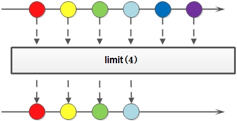

## 函数式编程与Lambda

函数式编程的核心思想是将计算过程视为数学函数的组合，避免可变状态和副作用，以实现更加清晰、可靠、可维护的代码。在函数式编程中，函数被看作是一等公民，可以被传递和返回，允许高阶函数（函数可以作为参数或返回值）和闭包（函数可以捕获和操作其周围的状态）。这种范式强调数据的不可变性，即一旦数据创建就不会被修改，所有的操作都是通过创建新的数据来实现的。

Lambda表达式是一种匿名函数，它可以被传递给其他函数作为参数，或者赋值给变量。它的语法简洁，可以用来替代传统的匿名内部类，使代码更加紧凑和易读。Lambda表达式在函数式编程中充当了高阶函数和闭包的角色，使得代码可以更自然地表达操作。

在Java中，函数式编程范式的引入主要是从Java 8开始的，通过Lambda表达式和Stream API，Java变得更加适合函数式编程风格的开发。

函数式编程在Java中的应用不仅使代码变得更加简洁和可读，还能够更好地支持并发编程和并行处理。通过使用不可变数据和无副作用的操作，函数式编程能够减少错误和提高代码质量。

函数式编程的优势在于：

* 易于理解和维护：函数式编程强调不可变性和无副作用，使得代码逻辑更清晰、更易于理解。由于函数式代码不依赖于共享状态，减少了副作用引发的意外行为，从而降低了代码的复杂性，也使得代码更容易维护和调试。

* 声明式编程：函数式编程强调"做什么"而不是"怎么做"，从而提供了更接近问题领域的抽象，使得代码更加自然、可读。这种声明式的编程风格使得开发者能够更专注于解决问题，而不是过多关注具体的实现细节。

* 并发和并行性：由于函数式编程中强调不可变性，函数不依赖于共享的状态，从而使得并发编程变得更加容易。函数式代码更容易进行并行处理，因为不会出现竞态条件和死锁等问题，这对于现代多核处理器架构非常重要。

* 可测试性：函数式代码通常是纯函数，即给定相同的输入总是产生相同的输出，不依赖于外部状态。这使得测试更加可预测，开发者可以更容易地编写单元测试和集成测试，从而提高代码的质量。

* 函数作为一等公民：函数式编程中的函数被视为一等公民，可以作为参数传递给其他函数，也可以作为返回值。这种灵活性使得开发者可以将函数组合、传递和重用，从而使代码更加模块化和可复用。

* 避免副作用：副作用是指对外部状态造成的修改，包括修改变量、数据库等。函数式编程鼓励最小化副作用，从而使代码更加可预测、稳定，并减少了难以追踪的错误。

* 软件设计原则的支持：函数式编程与一些设计原则（如单一职责原则、开闭原则）相契合，有助于构建更加模块化、可扩展的代码库。

<!-- more -->

### 行为参数化

"行为参数化"是函数式编程中一个重要的概念，它指的是通过将行为（函数或操作）作为参数传递给其他函数，从而使得代码更具灵活性和可重用性。这种方式可以让我们在不改变函数的基本结构的情况下，通过传递不同的行为来达到不同的效果。这在函数式编程中是非常常见且有用的。

具体来说，"行为参数化"可以通过以下几种方式来实现：

* 函数作为参数传递： 在函数式编程中，函数可以作为参数传递给其他函数。这意味着可以定义一个通用的函数，然后通过传递不同的函数作为参数，实现不同的行为。这种方式允许在不同的上下文中重复使用相同的函数逻辑。

* 接口或函数式接口传递： 在Java中，可以定义接口或函数式接口来表示某种行为，然后将实现了该接口的对象传递给其他函数。这样，可以在调用函数时传递不同的实现，从而实现不同的行为。

* Lambda 表达式传递： Lambda 表达式是一种匿名函数，可以作为参数传递给其他函数。通过使用 Lambda 表达式，可以在调用函数时内联地定义一个函数，从而实现行为参数化。

下面通过一个实际案例的演化来理解"行为参数化"的概念。

如果要从一个列表中筛选绿苹果，那么在Java8之前的大部分解决方案是：

```java
public static List<Apple> filterGreenApples(List<Apple> inventory) {
    List<Apple> result = new ArrayList<Apple>();
    for(Apple apple: inventory){
        if("green".equals(apple.getColor()) {
            result.add(apple);
        }
    }
    return result;
} 
```

此时如果需求更改为筛选红苹果或者其它颜色的苹果，那么就需要复制上面的代码，然后修改颜色判断条件，这样就会产生大量重复代码。如果把颜色变成参数，这样就能灵活地适应变化了：

```java
public static List<Apple> filterApplesByColor(List<Apple> inventory, String color) {
    List<Apple> result = new ArrayList<Apple>();
    for(Apple apple: inventory){
        if(color.equals(apple.getColor()) {
            result.add(apple);
        }
    }
    return result;
} 
```

看起算是解决了所有颜色筛选的问题，但是如果又要求筛选轻的苹果和重的苹果（重量大于150g），那么又会增加如下方法：

```java
public static List<Apple> filterApplesByWeight(List<Apple> inventory, int weight) {
    List<Apple> result = new ArrayList<Apple>();
    for(Apple apple: inventory){
        if(apple.getWeight() > weight) {
            result.add(apple);
        }
    }
    return result;
} 
```

从上面两个解决方案来看，虽然解决了筛选苹果的问题，但是复制了大部分的代码来实现遍历库存，并对每个苹果应用筛选条件。这有点儿令人失望，因为它打破了DRY（Don’t Repeat Yourself，不要重复自己）的软件工程原则。同时如果想要改变筛选遍历方式来提升性能呢？那就得修改所有方法的实现，而不是只改一个。

为了进一步提升代码的灵活性，我们可以将颜色和重量结合为一个方法，称为filter。不过就算这样，还是需要一种方式来区分想要筛选哪个属性，可以加上一个标志来区分对颜色和重量的查询，合并后的代码如下：

```java
public static List<Apple> filterApples(List<Apple> inventory, String color, int weight, boolean flag) {
    List<Apple> result = new ArrayList<Apple>();
    for(Apple apple: inventory){
        // 根据flag判断是根据颜色还是重量筛选
        if((flag && apple.getColor().equals(color)) || (!flag && apple.getWeight() > weight)) {
            result.add(apple);
        }
    }
    return result;
} 
```

这样做的确可以解决问题，但是代码看起来有点儿乱。而且，如果想要根据其他属性来筛选，比如形状、产地等，那么就需要修改filter方法的实现，最终形成一个巨大的非常复杂且难以维护的方法。

为了解决上面的问题，需要一种比添加很多参数更好的方法来应对变化的需求。让我们后退一步来看看更高层次的抽象。一种可能的解决方案是进行标准建模：需要根据Apple的某些属性（比如它是绿色的吗？重量超过150克吗？）来返回一个boolean值。我们把它称为谓词（即一个返回boolean值的函数）。让我们定义一个接口来对选择标准建模：

```java
public interface ApplePredicate{
    boolean test(Apple apple);
} 
```

接着使用ApplePredicate的多个实现代表不同的选择标准了，比如：

```java
public class AppleGreenColorPredicate implements ApplePredicate{
    public boolean test(Apple apple){
        return "green".equals(apple.getColor());
    }
}

public class AppleHeavyWeightPredicate implements ApplePredicate{
    public boolean test(Apple apple){
        return apple.getWeight() > 150;
    }
}
```

我们可以把这些标准看作filter方法的不同行为。这些和“策略设计模式”相关：定义一族算法，把它们封装起来（称为“策略”），然后在运行时选择一个算法。在这里，算法族就是ApplePredicate，不同的策略就是AppleHeavyWeightPredicate和AppleGreenColorPredicate。

但是，该怎么利用ApplePredicate的不同实现呢？需要filterApples方法接受ApplePredicate对象，对Apple做条件测试。这就是行为参数化：**让方法接受多种行为（或战略）作为参数，并在内部使用，来完成不同的行为。**

要在我们的例子中实现这一点，要给filterApples方法添加一个参数，让它接受ApplePredicate对象。这在软件工程上有很大好处：现在我们把filterApples方法迭代集合的逻辑与要应用到集合中每个元素的行为（这里是一个谓词）区分开了。

```java
public static List<Apple> filterApples(List<Apple> inventory, ApplePredicate p) {
    List<Apple> result = new ArrayList<Apple>();
    for(Apple apple: inventory){
        if(p.test(apple)) {
            result.add(apple);
        }
    }
    return result;
} 
```

行为参数化是一个很有用的模式，它能够轻松地适应不断变化的需求。这种模式可以把一个行为（一段代码）封装起来，并通过传递和使用创建的行为（例如对Apple的不同谓词）将方法的行为参数化。从上面的实例中我们可以发现如下特性：

* 传递代码/行为：filterApples方法的行为取决于通过ApplePredicate对象传递的代码。如图所示。


* 多种行为，一个参数：行为参数化的好处在于可以把迭代要筛选的集合的逻辑与对集合中每个元素应用的行为区分开来。这样可以重复使用同一个方法，给它不同的行为来达到不
同的目的，如图所示。


### Lambda表达式

Lambda表达式是函数式编程中的一个重要概念，它是一种匿名函数，可以作为参数传递给其他函数，或者赋值给变量。Lambda表达式的引入使得在编写代码时可以更加简洁、清晰，同时也支持更灵活的编程风格。在Java 8及以后的版本中，Lambda表达式被广泛用于实现函数式编程。

要理解Lambda表达式，以下是一些关键概念：

* 匿名函数：Lambda 表达式是一种匿名函数，它不需要一个显式的名称。相比传统的方法，你不需要为每个函数编写独立的方法名，这使得代码更加紧凑。Lambda表达式可以作为参数传递给方法或存储在变量中。

* 参数列表：Lambda 表达式可以带有一个或多个参数，这些参数位于括号内。参数的类型可以显式声明，也可以根据上下文自动推断。

* 箭头符号（->）：Lambda 表达式的参数列表后面跟着一个箭头符号（->），表示参数和函数体的分隔。

* 函数体：Lambda 表达式的函数体包含了要执行的操作。函数体可以是一个表达式，也可以是一组语句。

下面是一个简单的 Lambda 表达式示例：

```java
// 传统的方法
Runnable runnable = new Runnable() {
    @Override
    public void run() {
        System.out.println("Hello, world!");
    }
};

// 使用 Lambda 表达式
Runnable lambdaRunnable = () -> System.out.println("Hello, world!");
```

在这个示例中，`() -> System.out.println("Hello, world!")` 就是一个 Lambda 表达式。它没有参数，箭头后面是一个输出语句作为函数体。

### 函数式接口

Lambda表达式与函数式接口密切相关，它们在Java中一起支持了函数式编程的实现。函数式接口是Lambda表达式的基础，Lambda表达式通常是通过函数式接口来传递和使用的。Lambda表达式可以被视为函数式接口的实现。当使用Lambda表达式时，实际上是在提供一个匿名函数，这个匿名函数的类型是由目标函数式接口决定的。Lambda表达式的参数和返回类型必须与目标函数式接口的抽象方法保持一致。

**函数式接口是一个只包含一个抽象方法的接口。它可以有默认方法和静态方法，但只能有一个未实现的抽象方法。**函数式接口的目的是为了表示一种可以作为Lambda表达式的目标类型。在Java中，如果一个接口满足函数式接口的条件，那么它可以用作Lambda表达式的实现。Java中的许多标准接口，如`Runnable`、`Callable`等，都可以被视为函数式接口，我们再上文定义的`ApplePredicate`也是一个函数式接口。在Java8中，为了标注函数式接口，会为对应的函数式接口标注@FunctionalInterface注解，用于表示该接口会设计成一个函数式接口。如果你用@FunctionalInterface定义了一个接口，而它却不是函数式接口的话，编译器将返回一个提示原因的错误。请注意，@FunctionalInterface不是必需的。

**函数式接口的抽象方法的签名基本上就是Lambda表达式的签名。我们将这种抽象方法叫作函数描述符。**例如，`Runnable`接口可以看作一个什么也不接受什么也不返回（void）的函数的签名，因为它只有一个叫作run的抽象方法，这个方法什么也不接受，什么也不返回（void）。

函数式接口提供了一种规范，用于在Lambda表达式中明确地声明参数和返回类型。这使得Java编译器可以推断Lambda表达式的类型，并检查其与函数式接口是否匹配。

使用函数式接口和Lambda改造调用行为参数化filterApples的示例：

```java
// 使用匿名类调用
List<Apple> greenApples = filterApples(inventory, new ApplePredicate() {
    @Override
    public boolean test(Apple apple) {
        return "green".equals(apple.getColor());
    }
});
List<Apple> heavyApples = filterApples(inventory, new ApplePredicate() {
    @Override
    public boolean test(Apple apple) {
        return apple.getWeight() > 150;
    }
});
// 使用Lambda
List<Apple> greenApplesLambda = filterApples(inventory, apple -> "green".equals(apple.getColor()));
List<Apple> heavyApplesLambda = filterApples(inventory, apple -> apple.getWeight() > 150);
```

### JDK的函数式接口

JDK提供了许多常用的函数式接口，这些接口用于支持函数式编程风格。这些接口都定义在java.util.function包中，其中包括了函数的签名和描述符，以及用于支持常见函数式编程模式的默认方法。以下是一些常用的函数式接口及其主要用途：

* `java.util.function.Function<T, R>`：这个函数式接口表示一个函数，它接受一个参数类型为`T`的值，并返回一个参数类型为`R`的值。在函数式编程中，它用于对输入值进行转换、映射等操作。

```java
Function<Integer, String> intToString = num -> String.valueOf(num);
```

* `java.util.function.Predicate<T>`：这个函数式接口表示一个断言，它接受一个参数类型为`T`的值，返回一个布尔值。在函数式编程中，它用于判断一个值是否满足某种条件。

```java
Predicate<String> isLong = str -> str.length() > 5;
```

* `java.util.function.Consumer<T>`：这个函数式接口表示一个消费者，它接受一个参数类型为`T`的值，但没有返回值。在函数式编程中，它用于对值进行一些操作而不返回结果。

```java
Consumer<String> printUpperCase = str -> System.out.println(str.toUpperCase());
```

* `java.util.function.Supplier<T>`：这个函数式接口表示一个提供者，它不接受参数，但返回一个类型为`T`的值。在函数式编程中，它用于生成或提供值。

```java
Supplier<Double> getRandomNumber = () -> Math.random();
```

* `java.util.function.BinaryOperator<T>`：这个函数式接口表示一个二元操作，它接受两个参数类型为`T`的值，然后返回一个类型为`T`的值。在函数式编程中，它用于执行二元运算，如加法、乘法等。

```java
BinaryOperator<Integer> add = (a, b) -> a + b;
```

* `java.util.function.UnaryOperator<T>`：这个函数式接口表示一个一元操作，它接受一个参数类型为`T`的值，然后返回一个类型为`T`的值。在函数式编程中，它用于执行一元运算，如递增、取反等。

```java
UnaryOperator<Integer> increment = num -> num + 1;
```

* `java.util.function.BiFunction<T, U, R>`：这个函数式接口表示一个双参数函数，它接受两个参数类型为`T`和`U`的值，然后返回一个类型为`R`的值。在函数式编程中，它用于处理双参数函数操作。

```java
BiFunction<Integer, Integer, String> sumToString = (a, b) -> String.valueOf(a + b);
```

Java API中提供的最常用的函数式接口及其函数描述符参见下表：

|  函数式接口 | 函数描述符 | 原始类型特化 |
|:---:|:---:|---|
| Predicate<T> | T -> boolean | IntPredicate,<br> LongPredicate,<br> DoublePredicate |
| Consumer<T> | T -> void | IntConsumer,<br> LongConsumer,<br> DoubleConsumer |
| Function<T, R> | T -> R | IntFunction<R>,<br> IntToDoubleFunction,<br> IntToLongFunction,<br> LongFunction<R>,<br> LongToDoubleFunction,<br> LongToIntFunction,<br> DoubleFunction<R>,<br> ToIntFunction<T>,<br> ToDoubleFunction<T>,<br> ToLongFunction<T>, |
| Supplier<T> | () -> T | BooleanSupplier,<br> IntSupplier,<br> LongSupplier,<br> DoubleSupplier |
| UnaryOperator<T> | T -> T | IntUnaryOperator,<br> LongUnaryOperator,<br> DoubleUnaryOperator |
| BinaryOperator<T> | (T, T) -> T | IntBinaryOperator,<br> LongBinaryOperator,<br> DoubleBinaryOperator |
| BiPredicate<L, R> | (L, R) -> boolean |  |
| BiConsumer<T, U> | (T, U) -> void | ObjIntConsumer<T>,<br> ObjLongConsumer<T>,<br> ObjDoubleConsumer<T> |
| BiFunction<T, U, R> | (T, U) -> R | ToIntBiFunction<T, U>,<br> ToLongBiFunction<T, U>,<br> ToDoubleBiFunction<T, U> |

### Lambda与函数式接口的异常处理

编写任意的Java代码都无法绕过异常处理，那么在函数式接口中如何处理执行过程中的异常？请注意，**任何函数式接口都不允许抛出受检异常（checked exception）**。如果你需要Lambda表达式来抛出异常，有两种办法：定义一个自己的函数式接口，并声明受检异常，或者把Lambda包在一个try/catch块中。如下所示：

``` java
// 使用try-carch处理异常
Function<Integer, Integer> safeDivideByTwo = num -> {
    try {
        return num / 2;
    } catch (ArithmeticException e) {
        return 0; // 处理异常情况
    }
};

// 自定义函数式接口
@FunctionalInterface
interface CheckedFunction<T, R> {
    R apply(T t) throws Exception;
}

Function<Integer, Integer> divideByTwo = num -> {
    try {
        return num / 2;
    } catch (ArithmeticException e) {
        throw new RuntimeException("Divide by zero");
    }
};

```

选择哪种处理方式取决于具体的情况。如果异常情况是很常见的，最好的做法是在Lambda表达式内部处理异常，以确保代码的简洁性。如果异常情况是非常特殊的，可以考虑将异常传递到上层，让上层代码处理异常。无论如何，确保异常的处理方式在可读性、可维护性和异常处理的准确性方面都是合理的。

### 类型检查与类型推断

Lambda表达式本身并不包含它在实现哪个函数式接口的信息，Lambda的类型是从使用Lambda的上下文推断出来的。上下文（比如，接受它传递的方法的参数，或接受它的值的局部变量）中Lambda表达式需要的类型称为目标类型。在Java中的函数式编程中，类型检查和类型推断是两个重要的概念，它们有助于确保代码的正确性并使代码更加简洁。让我们分别理解这两个概念：

* 类型检查（Type Checking）：类型检查是指编译器在编译时检查代码中的数据类型，以确保类型的一致性和正确性。在函数式编程中，类型检查确保Lambda表达式或函数式接口的实现与目标类型匹配。

    让我们从如下代码来理解类型检查的大致流程：

    ``` java
    List<Apple> heavierThan150g = filterApples(inventory, (Apple a) -> a.getWeight() > 150);
    ```

    

    在函数式编程中，有时会出现同一个Lambda表达式被用于不同的函数式接口，即同样的Lambda表达式，不同的函数式接口。这种情况下，Lambda表达式的类型可以根据上下文中所期望的函数式接口的类型来推断。这种特性使得代码更加灵活、简洁，并且能够在不同的上下文中重用相同的Lambda实现。如下所示：

    ``` java
    Function<Integer, Integer> doubleFunction = num -> num * 2; // 将整数翻倍
    UnaryOperator<Integer> doubleOperator = num -> num * 2; // 同样将整数翻倍
    ```

    这里需要注意**特殊的void兼容规则。如果一个Lambda的主体是一个语句表达式，它就和一个返回void的函数描述符兼容（当然需要参数列表也兼容）。例如，以下两行都是合法的，尽管List的add方法返回了一个boolean，而不是Consumer上下文（T -> void）所要求的void。**

    ``` java
    Consumer<String> c = s -> list.add(s); // OK
    Predicate<String> p = s -> list.add(s); // OK
    ```

* 类型推断（Type Inference）：类型推断是指编译器自动推断变量或表达式的数据类型，而无需显式地指定类型。在函数式编程中，类型推断使得代码更加简洁，因为你不需要在每个地方都显式地写出类型。Lambda表达式通常使用类型推断来确定参数类型和返回类型。

    ``` java
    // 未指定a的类型，Java编译器可以根据上下文中的信息自动确定
    List<Apple> heavierThan150g = filterApples(inventory, a -> a.getWeight() > 150);
    ```

类型检查和类型推断相互配合，使得函数式编程在Java中更加便捷和易用。当创建Lambda表达式、实现函数式接口或使用函数式编程特性时，类型检查和类型推断都会在背后发挥作用，确保代码在编译时就能捕获潜在的类型错误，同时又不需要过多的类型显式声明。

### Lambda对变量的限制

Lambda表达式允许使用自由变量（不是参数，而是在外层作用域中定义的变量），就像匿名类一样。 它们被称作捕获Lambda。Lambda表达式内，可以访问外部的变量：局部变量、类变量和静态变量，但操作受限程度不一。**静态变量和成员变量可读可写，局部变量除访问外而不能修改。**如下所示：

``` java
// 使用lambda参数变量
Predicate<String> p = s -> s.equals("1");
// 使用局部变量，即捕获Lambda
int portNumber = 1337;
Runnable r = () -> System.out.println(portNumber);
```

虽然Lambda表达式可以访问其外部作用域中的局部变量，但是这些局部变量必须满足特定的限制。**Lambda可以没有限制地捕获（也就是在其主体中引用）实例变量和静态变量，但局部变量必须显式声明为final或事实上是final。** 即Lambda表达式内部可以访问外部作用域中的局部变量，但这些变量在实际操作中必须保持不可修改。这是为了确保Lambda表达式内部不会改变外部作用域中的变量值，从而避免潜在的并发问题或不确定的行为。对于Lambda表达式内部访问的局部变量，编译器会自动地将这些变量转化为隐式的final或等同于final的变量。

如下代码将无法通过编译，因为portNumber的值发生了改变：

``` java
int portNumber = 1337;
Runnable r = () -> System.out.println(portNumber);
portNumber = 31337;
```

之所以有此限制，是为了保证Lambda表达式在使用外部变量时的安全性和稳定性（实例变量和局部变量背后的实现有一个关键不同。实例变量都存储在堆中，而局部变量则保存在栈上。如果Lambda可以直接访问局部变量，而且Lambda是在一个线程中使用的，则使用Lambda的线程可能会在分配该变量的线程将这个变量收回之后去访问该变量。因此，Java在访问自由局部变量时，实际上是在访问它的副本，而不是访问原始变量）。这种限制有助于避免并发问题，使得代码在函数式编程中更加可靠。

### 方法引用

方法引用是一种在Java中支持函数式编程的特性，它允许你通过名称来引用已经存在的方法，从而将方法作为参数传递给其他方法或表达式。方法引用使得代码更加简洁、可读，并且有助于提高代码的可维护性。它的基本思想是，如果一个Lambda代表的只是“直接调用这个方法”，那最好还是用名称来调用它，而不是去描述如何调用它。在Java中，方法引用可以用于代替Lambda表达式，从而实现更加紧凑的代码。

使用方法引用时，目标引用放在分隔符::前，方法的名称放在后面。如下所示：

``` java
List<String> list = Arrays.asList("apple", "banana", "orange");
// 传统的写法
list.stream().forEach(s -> System.out.println(s));
// 方法引用
list.stream().forEach(System.out::println);
```

方法的引入有如下几类：

* 静态方法引用：`类名::静态方法名`。

    ``` java
    Function<String, Integer> function = Integer::parseInt;
    ```

* 实例方法引用：`特定类::实例方法名`。此类情况指对象本身是Lambda的一个参数的情况。即Lambda的签名为args -> args.method，其中args是ClassName类型的。

    ``` java
    Function<String, Integer> lengthFunction = String::length;
    ```

* 现有对象的实例方法的方法引用：`对象::实例方法名`。此类情况指对象非Lambda参数对象的情况，而是调用外部对象（如局部变量）中的方法。即Lambda的签名为args -> object.method(args)，其中object是外部对象。

    ``` java
    List<String> list = new ArrayList<>();
    Consumer<String> consumer = list::add;
    ```

* 构造方法引用：`类名::new`。

    ``` java
    Supplier<String> supplier = String::new;
    // 要求Apple中有一个含有一个Interger的构造函数
    Function<Integer, Apple> appleFun = Apple::new;
    ```

### 集合与流

集合是Java中使用最多的API，Java中的集合是常用的数据结构，它可以存储一组对象，并提供了一些常用的操作方法，比如添加、删除、查找等。然而，集合的操作通常是命令式的，需要使用循环等结构来实现，这样会导致代码的可读性和可维护性较差，同时也不够高效。尽管集合对于几乎任何一个Java应用都是不可或缺的，但集合操作却远远算不上完美。

流是Java API的新成员，是一种用于处理集合数据的高级抽象，对于流最简短的定义是“从支持数据处理操作的源生成的元素序列”。它允许你以声明性的方式操作数据，而无需关心底层的实现细节。通过使用流，你可以进行过滤、映射、排序、聚合等操作，而这些操作可以链式地组合起来，形成一个流水线。流的操作通常是惰性求值的，这意味着在真正需要结果之前，中间操作不会立即执行。

流的优点在于它可以让你以一种声明式的方式处理数据，而不是使用传统的命令式方式。流提供了一种更加简洁、灵活的方式来操作和处理集合中的数据，使得代码更具可读性、可维护性，同时还可以支持并行处理以提高性能。

流的特点如下：

* 声明性操作：你可以使用声明性的方式描述操作，而不需要关心具体的实现过程。

* 链式操作：操作可以链式地组合，形成一个操作流水线。

* 惰性求值：中间操作不会立即执行，只有终端操作触发求值。

* 可并行处理：流支持并行处理，可以利用多核处理器提高性能。

* 更少的可变状态：流操作通常不会修改集合中的数据，减少了可变状态的需求。

* 一次性消费：Stream只可以被消费一次,想要再次遍历必须重新生成。

* 内部迭代：与使用迭代器显式迭代的集合不同，流的迭代操作是在背后进行的，将迭代的控制权放在方法内部，用户不控制迭代逻辑。

### 使用流

Stream表示数据流，它没有数据结构，本身也不存储元素，其操作也不会改变源Stream，而是生成新Stream。作为一种操作数据的接口，它提供了过滤、排序、映射、规约等多种操作方法，这些方法按照返回类型被分为两类：**凡是返回Stream类型的方法，称之为中间方法（中间操作），其余的都是完结方法（完结操作）。完结方法返回一个某种类型的值，而中间方法则返回新的Stream。中间方法的调用通常是链式的，该过程会形成一个管道，当完结方法被调用时会导致立即从管道中消费值。**需要特别注意：Stream的操作尽可能以“延迟”的方式运行，也就是常说的“懒操作”，这样有助于减少资源占用，提高性能。对于所有的中间操作（除sorted外）都是运行在延迟模式下。

Stream的使用过程有着固定的模式： **创建Stream -> 中间操作 -> 完结操作**。

#### 创建Stream

你可以通过集合(stream()/parallelStream())、数组(Stream.of()/Arrays.Stream())、生成器方法(Stream类的generate/empty/iterate等方法)等方式创建Stream。

```java
List<String> fruits = Arrays.asList("apple", "banana", "cherry");
Stream<String> streamFromList = fruits.stream();
// 并行流
Stream<String> parallelStreamFromList = fruits.parallelStream();

String[] colors = {"red", "green", "blue"};
// 使用Arrays.stream
Stream<String> streamFromArray = Arrays.stream(colors);
// 使用Stream.of
Stream<String> streamFromArray2 = Stream.of(colors);

Stream<Integer> streamFromGenerate = Stream.generate(() -> new Random().nextInt(100));
Stream<Integer> streamFromIterate = Stream.iterate(0, n -> n + 2);
```

#### 中间操作（Intermediate Operations）

中间操作是对Stream进行转换和处理的操作，返回一个新的Stream。

* **filter(筛选)：** 对于Stream中包含的元素使用给定的过滤函数进行过滤操作，新生成的Stream只包含符合条件的元素。

    filter筛选过程如下图所示：

    

    ```java
    List<String> filteredFruits = fruits.stream()
                                        .filter(fruit -> fruit.startsWith("a"))
                                        .collect(Collectors.toList());
    ```

* **distinct(去重/切片)：** 对于Stream中包含的元素进行去重操作（去重逻辑依赖元素的equals方法），新生成的Stream中没有重复的元素。

    distinct去重过程如下图所示：

    

    ```java
    List<Integer> distinctNumbers = numbers.stream()
                                        .distinct()
                                        .collect(Collectors.toList());
    ```

* **limit(截断)：**  对一个Stream进行截断操作，获取其前N个元素，如果原Stream中包含的元素个数小于N，那就获取其所有的元素。

    limit截断过程如下图所示：

    

    ```java
    List<String> limitLists = strs.stream()
                                .limit(1)
                                .collect(Collectors.toList());

    ```

* **skip(跳过)：** 返回一个丢弃原Stream的前N个元素后剩下元素组成的新Stream，如果原Stream中包含的元素个数小于N，那么返回空Stream。

    skip跳过过程如下图所示：

    

    ```java
    List<String> skipLists = strs.stream()
                                .skip(1)
                                .collect(Collectors.toList());
    ```

* **map(映射)：** 对Stream中包含的元素使用给定的转换函数进行转换操作，新生成的Stream只包含转换生成的元素。

    map映射过程如下图所示：

    

    ```java
    List<String> fruitNames = fruits.stream()
                                    .map(fruit -> fruit.toUpperCase())
                                    .collect(Collectors.toList());
    ```

* **flatMap：** 将流中的每个元素映射为一个流，然后将所有的流合并成一个流，用于映射扁平化嵌套的结构。

    flatMap扁平化过程如下图所示：

    

    ```java
    List<List<Integer>> numberLists = Arrays.asList(
        Arrays.asList(1, 2, 3),
        Arrays.asList(4, 5, 6),
        Arrays.asList(7, 8, 9)
    );
    List<Integer> allNumbers = numberLists.stream()
                                        .flatMap(list -> list.stream())
                                        .collect(Collectors.toList());
    ```

* **peek:** 生成一个包含原Stream的所有元素的新Stream，同时会提供一个消费函数（Consumer实例），新Stream每个元素被消费的时候都会执行给定的消费函数。

    peek过程如下图所示：

    

    ```java
    List<String> peekLists = strs.stream()
                                .peek(str -> System.out.println(str))
                                .collect(Collectors.toList());
    ```

* **sorted：** 对元素进行排序。`sorted()`对流中的元素进行自然排序，即根据元素的自然顺序来进行排序，如果流的元素实现了`Comparable`接口，它们的自然顺序将由`compareTo`方法来决定。`sorted(Comparator<? super T> comparator)`方法允许你提供一个自定义的比较器（Comparator）来指定排序规则。

    ```java
    List<Integer> sortedNumbers = numbers.stream()
                                        .sorted()
                                        .collect(Collectors.toList());
    ```

* **takeWhile：** 返回满足条件的元素直到不满足（当筛选到不满足条件的元素时，后续元素不再参与筛选）为止。

    ```java
    List<Integer> numbers = List.of(9,8,7,1,4);
    // integerList的值为9，8，7
    List<Integer> integerList = numbers.stream()
                                    .takeWhile(number -> number > 3)
                                    .toList();
    ```

* **dropWhile：** 返回满足条件之后的元素（当筛选到第一个不满足条件时的后续所有元素，与takeWhile取值相反）。

    ```java
    List<Integer> numbers = List.of(9,8,7,1,4);
    // integerList的值为1，4
    List<Integer> integerList = numbers.stream()
                                    .dropWhile(number -> number > 3)
                                    .toList();
    ```

* **unordered：** 在有序流中取消排序，以提高性能。

    关于有序流（Ordered Stream）和无序流（Unordered Stream）：

  * 有序流（Ordered Stream）：有序流是指流中的元素保持其原始顺序的流。这意味着流的元素的顺序与源数据的顺序相同。通常情况下，对于顺序流，元素的顺序在流的操作过程中会得到保留。

  * 无序流（Unordered Stream）：无序流是指流中的元素没有固定的顺序。元素的顺序可能是随机的，无序流的操作可能会改变元素的顺序。在使用无序流时，你不能依赖于元素的顺序，因为它可能会在流的处理过程中发生变化。

    ```java
    List<Integer> unorderedNumbers = numbers.stream()
                                        .unordered()
                                        .collect(Collectors.toList());

    ```

* **sequential：** 将并行Stream转换为顺序Stream，使得数据处理具有可控性和可预测性，是Stream的默认方法，顺序Stream可以使用单线程对数据进行处理，因此处理效率可能不如并行Stream。

    ```java
    List<Integer> numbers = List.of(9,8,7,1,4);
    // integerList的值为1，4
    List<Integer> integerList = numbers.stream()
                                    // idea此处会给出代码建议：流是通过 'stream()' 创建的，所以它已经是顺序的
                                    .sequential()
                                    .dropWhile(number -> number > 3)
                                    .toList();
    ```

* **parallel：** 将Stream转换为并行Stream。

    ```java
    List<Integer> numbers = List.of(9,8,7,1,4);
    // integerList的值为1，4
    List<Integer> integerList = numbers.stream()
                                    .parallel()
                                    .dropWhile(number -> number > 3)
                                    .toList();
    ```

#### 终端操作（Terminal Operations）

终端操作是触发Stream求值的操作，返回一个结果或产生一个最终结果或副作用。

* **forEach：** 对流中的每个元素执行指定的操作。

    ```java
    fruits.stream().forEach(fruit -> System.out.println(fruit));
    ```

* **forEachOrdered：** 对流中的每个元素执行指定的有序操作，保证元素按照顺序处理。

    ```java
    fruits.stream().forEachOrdered(fruit -> System.out.println(fruit));
    ```

* **count：** 返回元素的个数。

    ```java
    long count = fruits.stream().count();
    ```

* **anyMatch：** 检查流中是否存在满足指定条件的元素。

    ```java
    boolean anyStartsWithA = fruits.stream().anyMatch(fruit -> fruit.startsWith("a"));
    ```

* **allMatch：** 检查流中是否所有元素都满足指定条件。

    ```java
    boolean allStartsWithA = fruits.stream().allMatch(fruit -> fruit.startsWith("a"));
    ```

* **noneMatch：** 检查流中是否没有满足指定条件的元素。

    ```java
    boolean noneStartsWithA = fruits.stream().noneMatch(fruit -> fruit.startsWith("a"));
    ```

* **findFirst：** 返回第一个元素。

    ```java
    Optional<String> firstFruit = fruits.stream().findFirst();
    ```

* **findAny：** 返回任意一个元素。

    ```java
    Optional<String> anyFruit = fruits.stream().findAny();
    ```

* **max：** 返回流中的最大值。

    ```java
    Optional<Integer> maxNumber = numbers.stream().max(Integer::compareTo);
    ```

* **min：** 返回流中的最小值。

    ```java
    Optional<Integer> minNumber = numbers.stream().min(Integer::compareTo);
    ```

* **toArray：** 将流中的元素转换为数组。

    ```java
    String[] fruitArray = fruits.stream().toArray(String[]::new);
    ```

* **iterator：** 返回一个迭代器。

    ```java
    Iterator<String> fruitIterator = fruits.stream().iterator();
    ```

* **reduce：** 对流中的元素进行规约操作，返回规约后的值。

    reduce操作可以实现从一组元素中生成一个值，sum()、max()、min()、count()等都是基于reduce实现的。其方法签名如下：

    ```java
    <U> U reduce(U identity,
                BiFunction<U, ? super T, U> accumulator,
                BinaryOperator<U> combiner);
    ```

    reduce方法有三个参数，分别是：

  * 初始值(identity)：它是规约操作的初始值。如果流为空，则返回初始值。如果流不为空，则将初始值作为累加器的初始值。

  * 累加器(accumulator)：它是一个BiFunction类型的函数，用于将流中的元素逐个累加起来。累加器接收两个参数，分别是上一次累加的结果和当前元素，然后返回一个新的结果。

  * 组合器(combiner)：它是一个BinaryOperator（其实也是BiFunction，只是类型限定为同一类型）类型的函数，用于将并行流中的结果合并起来。组合器接收两个参数，分别是两个并行流的结果，然后返回一个新的结果。

    ```java
    // 求单词长度之和
    Stream<String> stream = Stream.of("I", "love", "you", "too");
    Integer lengthSum = stream.reduce(0,　// 初始值　U identity
            (sum, str) -> sum + str.length(), // 累加器  BiFunction<U, ? super T, U> accumulator
            (a, b) -> a + b);　// 部分和拼接器，并行执行时才会用到 BinaryOperator<U> combiner
    // int lengthSum = stream.mapToInt(str -> str.length()).sum();
    System.out.println(lengthSum);
    ```

    

* **collect：** 将输入元素累计到一个可变的结果容器中。

    collect将Stream元素累计到一个可变的结果容器中。与reduce一致，将Stream元素累计到一个可变的结果容器中，我们依然需要定义初始容器（目标容器）、累加器、组合器。其基础方法签名如下：

    ```java
    <R> R collect(Supplier<R> supplier,
                BiConsumer<R, ? super T> accumulator,
                BiConsumer<R, R> combiner);
    ```

    collect方法有三个参数，分别是：

  * 目标容器(supplier)：它是一个Supplier类型的函数，用于提供目标容器。在串行流中，它只会被调用一次。在并行流中，它会被多次调用，每个线程都会有一个自己的目标容器。

  * 累加器(accumulator)：它是一个BiConsumer类型的函数，用于将流中的元素逐个添加到目标容器中。累加器接收两个参数，分别是目标容器和当前元素。

  * 组合器(combiner)：它是一个BiConsumer类型的函数，用于将并行流中各个线程的结果合并起来。组合器接收两个参数，分别是两个并行流的结果，然后返回一个新的结果。

    ```java
    //　将Stream规约成List
    Stream<String> stream = Stream.of("I", "love", "you", "too");
    List<String> list = stream.collect(ArrayList::new, // 创建目标容器，() -> new ArrayList，简写为ArrayList::new
            ArrayList::add, // 累加器，如何将流中的元素添加的目标容器，(list, item) -> list.add(item)，简写为ArrayList::add
            ArrayList::addAll // 组合器，如何将并行流的结果合并，(list1, list2) -> list1.addAll(list2)，简写为ArrayList::addAll
    );
    System.out.println(list);
    ```

    

    由于每次调用collect()都要传入这三个参数太麻烦，JDK对其进行了简单封装，创建了收集器Collector，所以collect()的另一定义为：

    ```java
    <R, A> R collect(Collector<? super T, A, R> collector);
    ```

    Collector是一个接口，它是一个可变的汇聚操作，将输入元素累计到一个可变的结果容器中；它会在所有元素都处理完毕后，将累积的结果转换为一个最终的表示（这是一个可选操作）。Collector接口定义如下：

    ```java
    /*
    * T：表示流中每个元素的类型。
    * A：表示中间结果容器的类型（累加器的类型，累加器是在收集过程中用于累加部分结果的对象）。
    * R：表示收集操作得到的对象（通常但并不一定是集合）的类型。
    */
    public interface Collector<T, A, R> {
        // 用于创建结果容器，目标类型为A
        Supplier<A> supplier();
        // 用于将元素添加到结果容器，将元素 T 添加到结果容器 A
        BiConsumer<A, T> accumulator();
        // 用于将不同的结果容器合并起来（并行流时每个流都会创建一个结果容器），用于并行流
        BinaryOperator<A> combiner();
        // 用于将累加器 A 转换为最终结果 R
        Function<A, R> finisher();
        /*
         * 用于描述收集器的行为，返回一个不可变的Characteristics集合，它定义了收集器的行为
         * Characteristics是一个包含三个项目的枚举：
         * * UNORDERED：归约结果不受流中项目的遍历和累积顺序的影响。表示流中的元素无序。
         * * CONCURRENT：accumulator函数可以从多个线程同时调用，且该收集器可以并行归约流。如果收集器没有标为UNORDERED，那它仅在用于无序数据源时才可以并行归约。
         * * IDENTITY_FINISH：这表明完成器方法返回的函数是一个恒等函数，可以跳过。这种情况下，累加器对象将会直接用作归约过程的最终结果。这也意味着，将累加器A不加检查地转换为结果R是安全的。此时finiser方法不会被调用。
        */
        Set<Characteristics> characteristics();
    }
    ```

    Collectors本身提供了关于Collector的常见汇聚实现，Collectors的内部类CollectorImpl实现了Collector接口，Collectors本身实际上是一个工厂。下面以toList()为例，看一下Collector的实现：

    ```java
    public static <T> Collector<T, ?, List<T>> toList() {
        return new CollectorImpl<>(ArrayList::new,  // 创建目标容器，即supplier
                                List::add, // 累加器，即accumulator
                                (left, right) -> { left.addAll(right); return left; }, // 组合器，即combiner
                                // 无需转换，直接返回目标容器，即无finisher
                                Collections.unmodifiableSet(EnumSet.of(Collector.Characteristics.IDENTITY_FINISH)) // 中间结果容器类型与最终结果类型一致无需转换，即characteristics
                                );
    }
    ```

    `Collectors` 类提供了一系列工厂方法，用于创建不同类型的收集器（`Collector`）。这些工厂方法可以方便地创建常见的收集器实例，用于对流进行不同类型的操作和归约。以下是一些常用的 `Collectors` 工厂方法：

    * **`toCollection`：** 将流中的元素累计到一个集合中。

        ```java
        List<Integer> numbers = Arrays.asList(1, 2, 3, 4, 5);
        List<Integer> numberList = numbers.stream().collect(Collectors.toCollection(ArrayList::new));
        ``

    * **`toList`：** 将流中的元素累计到一个List中。

        ```java
        List<Integer> numbers = Arrays.asList(1, 2, 3, 4, 5);
        List<Integer> numberList = numbers.stream().collect(Collectors.toList());
        ```

    * **`toUnmodifyList`：** 将流中的元素累计到一个不可修改的List中，任何添加、删除或更新元素的尝试都会导致抛出`UnsupportedOperationException`异常。

        ```java
        List<Integer> numbers = Arrays.asList(1, 2, 3, 4, 5);
        List<Integer> numberList = numbers.stream().collect(Collectors.toUnmodifiableList());
        ```

    * **`toSet`：** 将流中的元素累计到一个Set中。

        ```java
        List<Integer> numbers = Arrays.asList(1, 2, 2, 3, 3, 4, 5);
        Set<Integer> numberSet = numbers.stream().collect(Collectors.toSet());
        ```

    * **`toUnmodifySet`：** 将流中的元素累计到一个不可修改的Set中，任何添加、删除或更新元素的尝试都会导致抛出`UnsupportedOperationException`异常。

        ```java
        List<Integer> numbers = Arrays.asList(1, 2, 2, 3, 3, 4, 5);
        Set<Integer> numberSet = numbers.stream().collect(Collectors.toUnmodifiableSet());
        ```

    * **`mapping`：** 对流中的元素进行映射，并将映射结果收集到一个指定的`downstream`收集器中。

        ```java
        List<String> words = Arrays.asList("Hello", "world", "Java", "Stream");
        List<Integer> wordLengths = words.stream()
                                        .collect(Collectors.mapping(
                                            String::length, // mapper，映射函数，必需
                                            Collectors.toList() // downstream，映射结果收集器，必需
                                            ));
        // Collectors.mapping等同于先map再collect
        List<Integer> wordLengths1 = words.stream()
                                        .map(String::length)
                                        .collect(Collectors.toList());
        ```

    * **`flatMapping`：** 对流中的元素进行映射，并将映射结果收集到一个指定的`downstream`收集器中，与`mapping`不同的是，`flatMapping`会将映射结果扁平化处理。

        ```java
        List<List<Integer>> numberLists = Arrays.asList(
            Arrays.asList(1, 2, 3),
            Arrays.asList(4, 5, 6),
            Arrays.asList(7, 8, 9)
        );
        List<Integer> allNumbers = numberLists.stream()
                                            .collect(Collectors.flatMapping(
                                                list -> list.stream(), // mapper，映射函数，必需
                                                Collectors.toList() // downstream，映射结果收集器，必需
                                                ));
        // Collectors.flatMapping等同于先flatMap再collect
        List<Integer> allNumbers1 = numberLists.stream()
                                            .flatMap(list -> list.stream())
                                            .collect(Collectors.toList());
        ```

    * **`filtering`：** 对流中的元素进行过滤，并将过滤结果收集到一个指定的`downstream`收集器中。

        ```java
        List<Integer> numbers = Arrays.asList(1, 2, 3, 4, 5);
        List<Integer> evenNumbers = numbers.stream()
                                            .collect(Collectors.filtering(
                                                number -> number % 2 == 0, // predicate，过滤条件，必需
                                                Collectors.toList() // downstream，过滤结果收集器，必需
                                                ));
        // Collectors.filtering等同于先filter再collect
        List<Integer> evenNumbers1 = numbers.stream()
                                            .filter(number -> number % 2 == 0)
                                            .collect(Collectors.toList());
        ```

    * **`collectingAndThen`：** 对流中的元素进行收集，并将收集结果转换为另一种类型。

        ```java
        List<String> numbers = Arrays.asList("1", "2", "3", "4", "5");
        String numberString = numbers.stream()
                                    .collect(Collectors.collectingAndThen(
                                        Collectors.joining(", "), // downstream，收集结果收集器，必需
                                        str -> "[" + str + "]" // finisher，收集结果转换函数，必需
                                        ));
        // Collectors.collectingAndThen等同于先collect再转换
        String numberString1 = numbers.stream()
                                    .collect(Collectors.joining(", ", // delimiter，分隔符，可选
                                        "[", // prefix，前缀，可选
                                        "]" // suffix，后缀，可选
                                        ));
        ```

    * **`counting`：** 对流中的元素进行计数。

        ```java
        List<Integer> numbers = Arrays.asList(1, 2, 3, 4, 5);
        long count = numbers.stream().collect(Collectors.counting());
        ```

    * **`maxBy`：** 计算流中元素的最大值。

        ```java
        List<Integer> numbers = Arrays.asList(1, 2, 3, 4, 5);
        Optional<Integer> maxNumber = numbers.stream()
                                            .collect(Collectors.maxBy(Integer::compareTo));
        ```

    * **`minBy`：** 计算流中元素的最小值

        ```java
        List<Integer> numbers = Arrays.asList(1, 2, 3, 4, 5);
        Optional<Integer> minNumber = numbers.stream()
                                            .collect(Collectors.minBy(Integer::compareTo));
        ```

    * **`toMap`：** 将流中的元素累计到一个Map中。

        ```java
        List<Person> people = Arrays.asList(
            new Person("Alice", 25),
            new Person("Bob", 30),
            new Person("Charlie", 28)
        );
        Map<String, Integer> ageMap = people.stream()
                                            .collect(Collectors.toMap(
                                                Person::getName, // keyMapper，键的映射函数，必需
                                                Person::getAge, // valueMapper，值的映射函数，必需
                                                (existingValue, newValue) -> existingValue, // mergeFunction，遇到相同键的情况，如何处理相同键的值，可选
                                                LinkedHashMap::new // mapFactory，用于创建Map实例，可选
                                                )); 
        ```

    * **`toCurrentMap`：** 同toMap()，将流中的元素放入一个线程安全的`ConcurrentHashMap`中。这在多线程环境下是安全的，多个线程可以并发地将元素添加到 `ConcurrentHashMap`中。

        ```java
        List<Person> people = Arrays.asList(
            new Person("Alice", 25),
            new Person("Bob", 30),
            new Person("Charlie", 28)
        );
        ConcurrentMap<String, Integer> ageMap = people.stream()
            .collect(Collectors.toConcurrentMap(
                Person::getName, // keyMapper，键的映射函数，必需
                Person::getAge, // valueMapper，值的映射函数，必需
                (existingValue, newValue) -> existingValue, // mergeFunction，遇到相同键的情况，如何处理相同键的值，可选
                ConcurrentHashMap::new // mapFactory，用于创建ConcurrentMap实例，可选
                ));                                   
        ```

    * **`toUnmodifiableMap`：** 同toMap()，将流中的元素放入一个不可修改的Map中，任何添加、删除或更新元素的尝试都会导致抛出`UnsupportedOperationException`异常。

        ```java
        List<Person> people = Arrays.asList(
            new Person("Alice", 25),
            new Person("Bob", 30),
            new Person("Charlie", 28)
        );
        Map<String, Integer> ageMap = people.stream()
                                            .collect(Collectors.toUnmodifiableMap(
                                                Person::getName, // keyMapper，键的映射函数，必需
                                                Person::getAge, // valueMapper，值的映射函数，必需
                                                (existingValue, newValue) -> existingValue, // mergeFunction，遇到相同键的情况，如何处理相同键的值，可选
                                                )); 
        ```

    * **`joining`：** 将流中的元素累计到一个字符串中。

        ```java
        List<String> words = Arrays.asList("Hello", "world", "Java", "Stream");
        String concatenated = words.stream()
                                    .collect(Collectors.joining(
                                        ", ", // delimiter，分隔符，可选
                                        "[", // prefix，前缀，可选
                                        "]" // suffix，后缀，可选
                                        ));
        System.out.println(concatenated); // 输出：[Hello, world, Java, Stream]
        ```

    * **`groupingBy`：** 将流中的元素按照指定的分类函数进行分组，生成一个Map。

        ```java
        List<Person> people = Arrays.asList(
            new Person("Alice", 25),
            new Person("Bob", 30),
            new Person("Charlie", 25)
        );
        Map<Integer, Set<String>> ageToNames = people.stream()
            .collect(Collectors.groupingBy(
                Person::getAge, // classifier，分类函数，必需
                LinkedHashMap::new, // mapFactory，用于创建Map实例，可选
                Collectors.mapping(Person::getName, Collectors.toSet()) // downstream，用于对分组结果进行进一步处理，可选
                ));
        ```

    * **`groupingByConcurrent`：** 同groupingBy()，将流中的元素按照指定的分类函数进行分组，生成一个线程安全的ConcurrentMap。

        ```java
        List<Person> people = Arrays.asList(
            new Person("Alice", 25),
            new Person("Bob", 30),
            new Person("Charlie", 25)
        );
        ConcurrentMap<Integer, Set<String>> ageToNames = people.stream()
            .collect(Collectors.groupingByConcurrent(
                Person::getAge, // classifier，分类函数，必需
                ConcurrentHashMap::new, // mapFactory，用于创建ConcurrentMap实例，可选
                Collectors.mapping(Person::getName, Collectors.toSet()) // downstream，用于对分组结果进行进一步处理，可选
                ));
        ```

    * **`reducing`：** 对流中的元素进行规约操作，返回规约后的值。

        ```java
        List<Integer> numbers = Arrays.asList(1, 2, 3, 4, 5);
        Integer sum = numbers.stream()
                            .collect(Collectors.reducing(
                                0, // identity，初始值，可选
                                a -> a * 2, // mapper，映射函数，可选
                                (a, b) -> a + b // op，累加器，必需
                                ));
        // Collectors.reducing如果有mapper函数时，等同于先map再reduce
        Integer sum1 = numbers.stream().map(a -> a * 2).reduce(0, (a, b) -> a + b);
        ```

    * **`partitioningBy`：** 将流中的元素按照指定的条件进行分区，生成一个Map。

        ```java
        List<Person> people = Arrays.asList(
            new Person("Alice", 25),
            new Person("Bob", 30),
            new Person("Charlie", 25)
        );
        Map<Boolean, List<Person>> partitioned = people.stream()
            .collect(Collectors.partitioningBy(
                person -> person.getAge() > 25, // predicate，分区条件，必需
                LinkedHashMap::new // mapFactory，用于创建Map实例，可选
                ));
        ```

    * **`summingInt`/`summingLong`/`summingDouble`：** 将流中的元素累加到一个数值中。

        ```java
        List<Person> people = Arrays.asList(
            new Person("Alice", 25),
            new Person("Bob", 30),
            new Person("Charlie", 25)
        );
        int sum = people.stream()
                        .collect(Collectors.summingInt(Person::getAge));
        ```

    * **`summarizingInt`/`summarizingLong`/`summarizingDouble`：** 生成一个包含流中元素统计信息的对象。

        ```java
        List<Person> people = Arrays.asList(
            new Person("Alice", 25),
            new Person("Bob", 30),
            new Person("Charlie", 25)
        );
        IntSummaryStatistics statistics = people.stream()
                                                .collect(Collectors.summarizingInt(Person::getAge));
        System.out.println("Count: " + statistics.getCount());
        System.out.println("Sum: " + statistics.getSum());
        System.out.println("Average: " + statistics.getAverage());
        System.out.println("Max: " + statistics.getMax());
        System.out.println("Min: " + statistics.getMin());
        ```

    * **`averagingInt`/`averagingLong`/`averagingDouble`：** 计算流中的元素的平均值

        ```java
        List<Person> people = Arrays.asList(
            new Person("Alice", 25),
            new Person("Bob", 30),
            new Person("Charlie", 25)
        );
        double average = people.stream()
                                .collect(Collectors.averagingInt(Person::getAge));
        ```

    * **`teeing`：** 将流中的元素同时收集到两个收集器中，并对两个收集器的结果进行进一步处理。

        ```java
        List<Person> people = Arrays.asList(
            new Person("Alice", 25),
            new Person("Bob", 30),
            new Person("Charlie", 25)
        );
        Map<Boolean, Integer> ageMap = people.stream()
                                            .collect(Collectors.teeing(
                                                Collectors.filtering(person -> person.getAge() > 25, Collectors.counting()), // 第一个收集器，必需
                                                Collectors.filtering(person -> person.getAge() <= 25, Collectors.counting()), // 第二个收集器，必需
                                                (over25, under25) -> Map.of(true, over25, false, under25) // 对两个收集器的结果进行进一步处理，必需
                                                ));
        ```

### 数值流（Numeric Streams）

数值流（Numeric Streams）是Java引入的一种特殊类型的流，用于处理基本数据类型的数据，如 `int`、`long` 和 `double`。数值流的引入旨在提高处理基本数据类型的效率，在进行数值计算时，数值流可以提供更高的性能（**减少装箱（Boxing）和拆箱（Unboxing）操作**）和更少的内存开销。

数值流的引入是因为在处理大量数据时，使用包装类型（如 `Integer`、`Long`、`Double` 等）会产生额外的内存开销和性能损耗。通过使用数值流，我们可以避免不必要的装箱和拆箱，从而提高代码的执行效率。但使用普通流可以更加灵活，因为它们支持更多的操作和转换。

数值流与普通流（引用流）之间的主要区别在于它们的元素类型。普通流处理的是对象引用，而数值流处理的是基本数据类型。数值流提供了特定的操作，例如求和、最大值、最小值等，以及与数值相关的方法。

流与数值流可以相互转换：

* 从流到数值流的转换：通过调用 `mapToInt`、`mapToLong` 或 `mapToDouble` 方法，可以将普通流转换为相应的数值流。

```java
List<Integer> numbers = Arrays.asList(1, 2, 3, 4, 5);
IntStream intStream = numbers.stream().mapToInt(Integer::intValue);
```

* 从数值流到流的转换：通过调用 `boxed` 方法，可以将数值流转换为普通流。

```java
IntStream intStream = IntStream.rangeClosed(1, 5);
Stream<Integer> boxedStream = intStream.boxed();
```

### 并行流（Parallel Streams）

并行流是Java中的一种特殊类型的流，它可以将流中的元素分成多个部分（顺序流会按照元素的顺序依次处理），并行处理这些部分，最后将结果合并起来。并行流的引入旨在提高处理大量数据时的效率，通过利用多核处理器的优势，可以加速数据处理的速度。

Java中的并行流底层使用的是ForkJoinPool线程池，当我们使用并行流时，流框架会自动将流中的元素分成多个部分，然后将这些部分分配给ForkJoinPool线程池中的线程执行。

并行流与普通流可以相互转换：

* 从流到并行流的转换：通过调用 `parallel` 方法，可以将普通流转换为并行流，或者使用 parallelStream() 方法创建一个并行流。

```java
List<Integer> numbers = Arrays.asList(1, 2, 3, 4, 5, 6, 7, 8, 9, 10);

// 使用 parallel() 方法将普通流转换为并行流
Stream<Integer> parallelStream = numbers.stream().parallel();

// 使用 parallelStream() 方法创建并行流
Stream<Integer> anotherParallelStream = numbers.parallelStream();

```

* 从并行流到流的转换：通过调用 `sequential` 方法，可以将并行流转换为普通流。

```java
List<Integer> numbers = Arrays.asList(1, 2, 3, 4, 5, 6, 7, 8, 9, 10);
Stream<Integer> parallelStream = numbers.parallelStream();

// 将并行流转换为普通流
Stream<Integer> sequentialStream = parallelStream.sequential();

```

需要注意的是，并行流并不是在所有情况下都比顺序流更快。它适用于大数据集的情况，而在小数据集或本身操作耗时较短的情况下，线程的创建和切换可能会带来额外的开销，使并行流不如顺序流高效。因此，在选择使用并行流时，需要根据实际情况进行评估和测试，以确定是否能够提高性能。
